| Disclaimer |
|------------|
| This document covers the DIY installation of the CD-i 400/500 series RGB board. Mobius Strip Technologies, Retro Gamer Stuff Limited and/or any of their associates cannot be held responsible for any damage that occurs from the improper installation of this device. It is expected that the person performing this installation has the necessary tools and knowledge to safely do so. If you are not comfortable with electrical circuits, discharging capacitors, using basic hand tools, soldering, or working with electronic devices with high ElectroStatic Discharge sensitivity, please stop now and consult a qualified technician. You have been warned.|

# Input Jumper Settings

The majority of installations will require the solder jumpers set to the left. If you find the video output to be too dark, switch the solder jumpers to the right. The DVS VE-200 is known to require this setting.

Jumpers Left:  
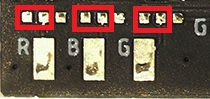

Jumpers Right:  
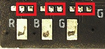

# Compatibility
Compatible with all Philips CD-i consoles with a BT9106, BT9107, or BT9108 encoder.

A list of models known to contain this encoder is as follows:

210/40  
210/60  
220/60  
220/80  
220/97  
FW380i  
450 (Tested Working. Requires Solder Jumper to Left.)  
470 (Tested Working. Requires Solder Jumper to Left.)  
490  
550 (Tested Working. Requires Solder Jumper to Left.)  
5000  
9000  
GDI-700M  
GDI-750  
GDI-1000  
TV: 21TCDI30  
740/00  
615/00  
660/00  
670/00  
DVS VE-200 (Tested Working. Requires Solder Jumper to Right.)  

# Installation

* It is expected that you already know how to open your CD-i console. If you are unfamiliar with this process, please seek out tutorials on disassembling your CD-i console. Please note that the documentation for this modification will feature images from CD-i 450 and CD-i 550 systems only. While compatible with other systems with these encoders, some components may have different designations or locations. Please consult a service manual if you are unsure.

* With your CD-i opened, your main board should look like this. It is recommended that you completely remove the main board for this installation.

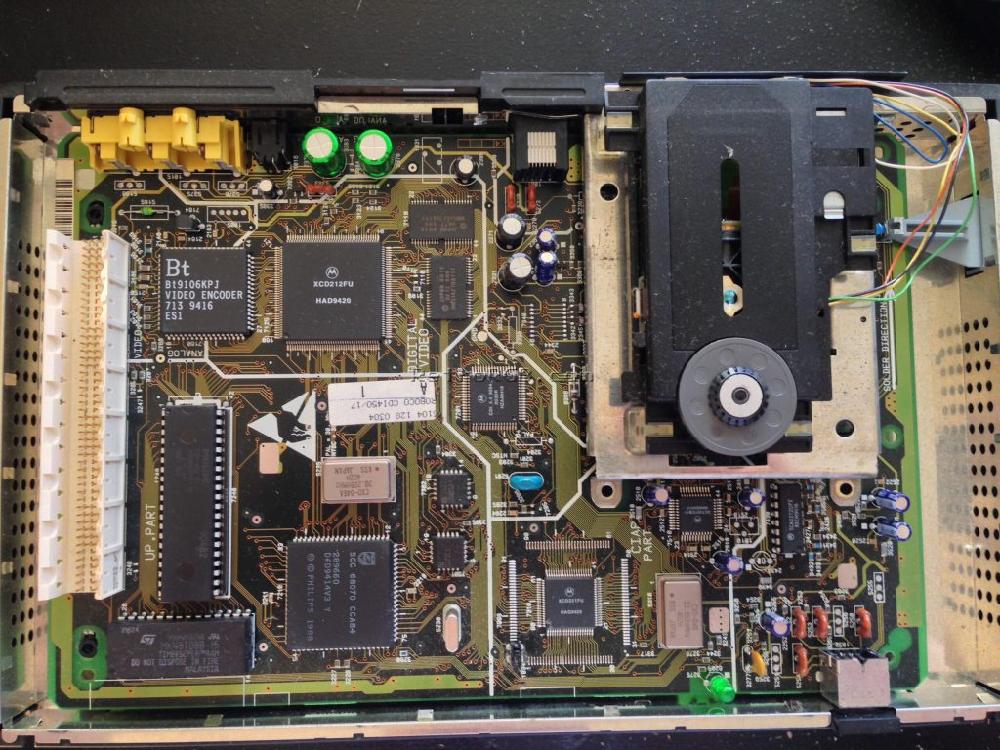

* Now with the main board removed, you can begin by identifying the locations where you will need to connect your wires. See the images below for the locations, as well as a pinout reference from the CD-i Service manual.

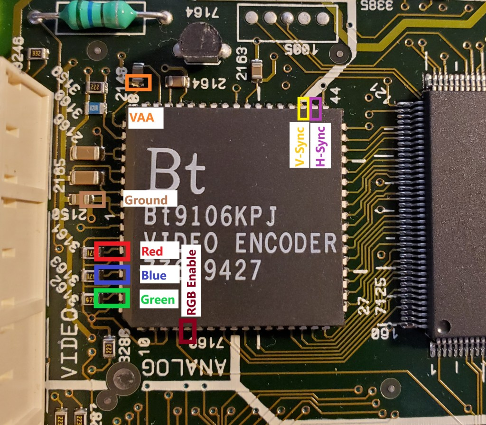

Note the locations of the signals you will need to tap.

Red = Pin 4  
Blue = Pin 6  
Green = Pin 8  
RGB Enable = Pin 14  
V-Sync = Pin 46  
H-Sync = Pin 45  
Ground = Pin 1  
VAA = Pin 66 or 65

**Important Note:** On some models the capacitor shown for connecting VAA is backwards. Connecting this backwards will not cause damage, but the RGB board will not work. Verify that the side of the capacitor you are connecting to is connected to Pin 66 or 65 and not Ground. Special thanks to Simon Laroche for pointing this out!

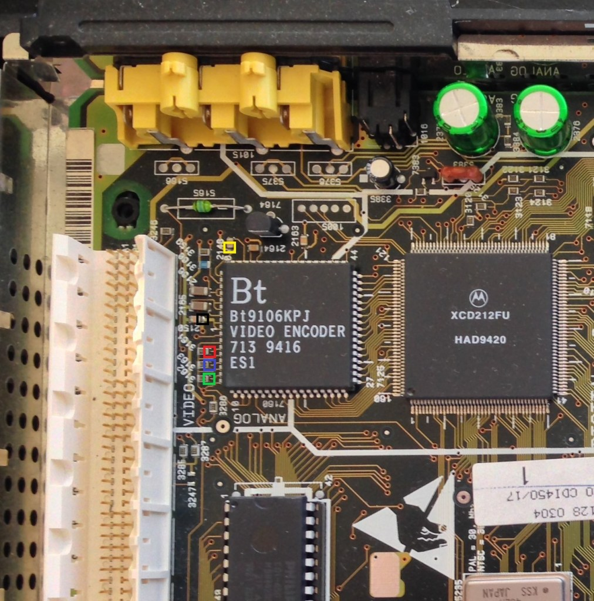

* In the above picture are alternate locations for connecting Red, Green, Blue, VAA, and Ground wires. For all connections in this picture, be sure to connect to the side of the capacitor or resistor closest to the BT9106 chip. VAA can be connected to the capacitor marked in Yellow near pin 60. Ground can be connected to the capacitor marked in Black. Red, Green, and Blue can be connected to the 3 resistors marked in their specific colors.

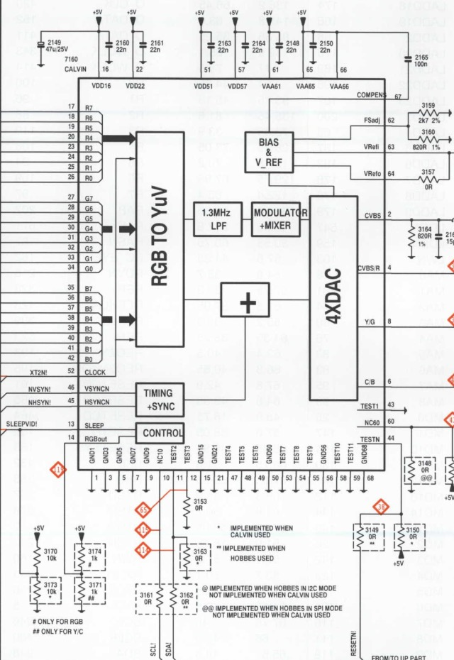

* To enable RGB on the BT9106/7/8 you must connect pin 14 of the chip through a 1k ohm resistor. This is provided for you on the RGB board. Before connecting this wire, you will need to remove the current resistor to ground. This resistor is found on the bottom of the main board. Flip over the main board and locate resistor 3171 in the ANALOG VIDEO section. Seen below in the Red box.

Please note, this designation may vary from model to model. This can be checked in the CD-i service manual or with a multi-meter (DMM). Enabling RGB mode will disable S-Video (Y/C) output. If your console has a S-Video port, it will cease to function with this modification.

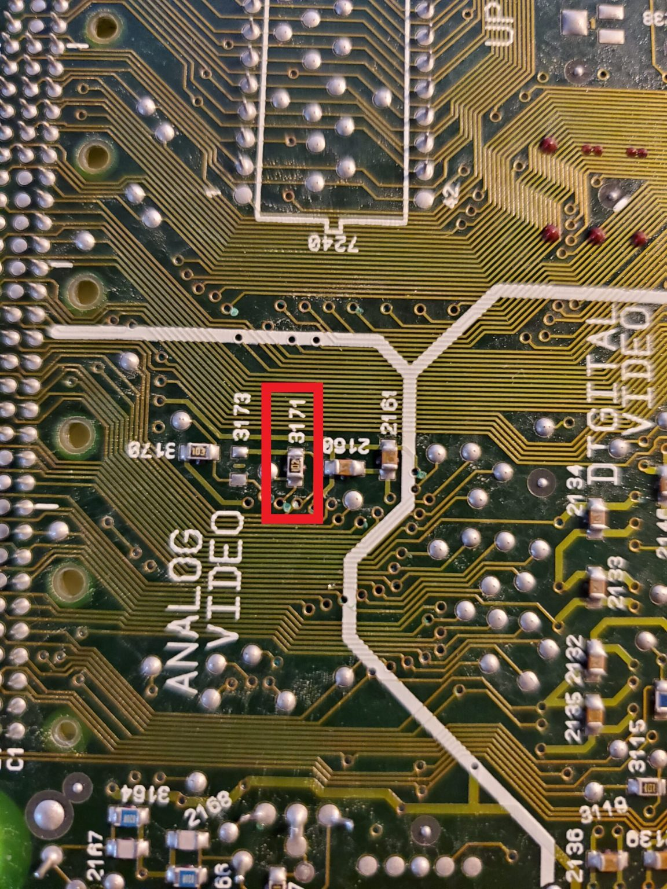

* Go ahead and remove this resistor.

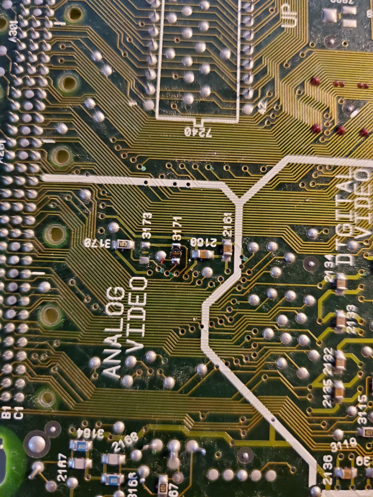

* Now that you know where to connect your input signals and have removed the resistor to prevent RGB, it’s time to choose a mounting location. There is plenty of space to mount your RGB board on top of the Motorola chip next to the BT9106. You can also mount it in the space next to the oscillator, or anywhere else of your choosing with adequate horizontal space.

* It is recommended that you connect your wires prior to mounting your RGB board. Just in case there is any overlap. For additional reference below are pictures showing the signal wires attached and board mounted on the Motorola chip.

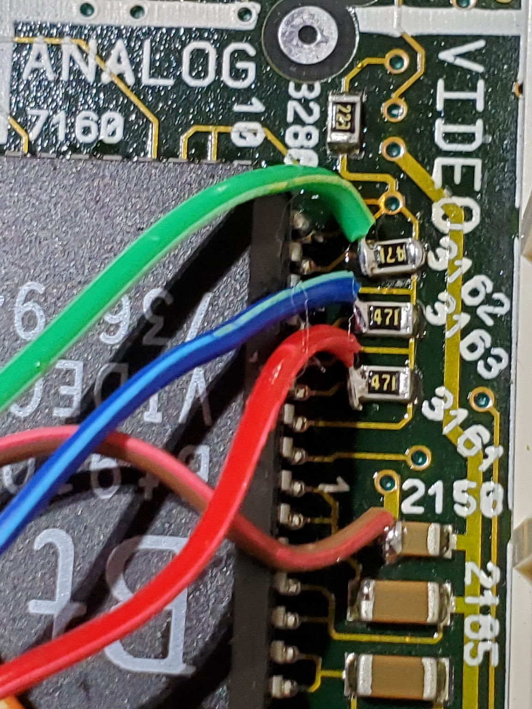

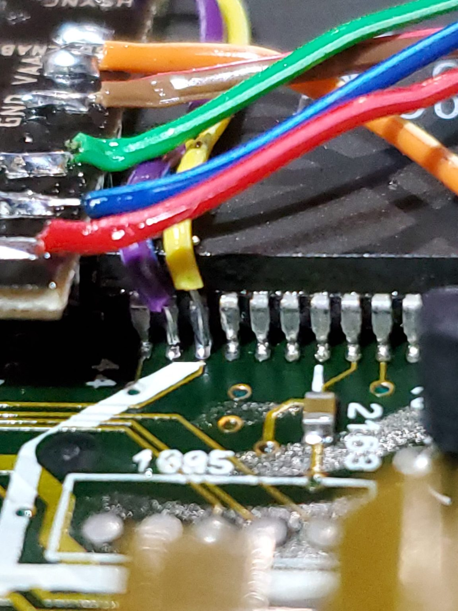

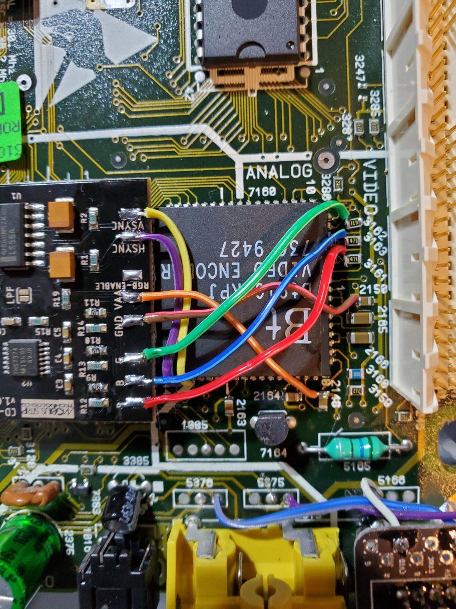

* With all of the wires connected, you may now connect your output connector. If you are using a 8pin miniDIN(NESRGB/Framemeister pinout), NeoGeo AES, or any other pin configuration that expects no components in the cable, use the pad labeled CS75 for 75ohm impedance CSync. This signal should be compatible with all 75ohm CSync capable devices. If you are using a Genesis/MegaDrive 9pin miniDIN or Genesis/MegaDrive 8pin DIN you will also need to remove and bridge the pads for resistors R16, R17, and R18 on the RGB board. As well as capacitors C8, C9, and C10 on the same board. You may then use the CS-TTL pad for a TTL level CSync. This CSync does require a 470ohm resistor and 220uf capacitor on the sync line to prevent damage to your output device. This is installed by default on any properly made Genesis/MegaDrive cable.

* While we do not detail the installation of the output connector, there are limited locations in the 450/550 for your connector. Most people will opt for removing the RCA jacks, or drilling a hole in one of the corners to fit their connector. See below for examples of the 8pin miniDIN and 9pin miniDIN installed in place of the composite video jack.

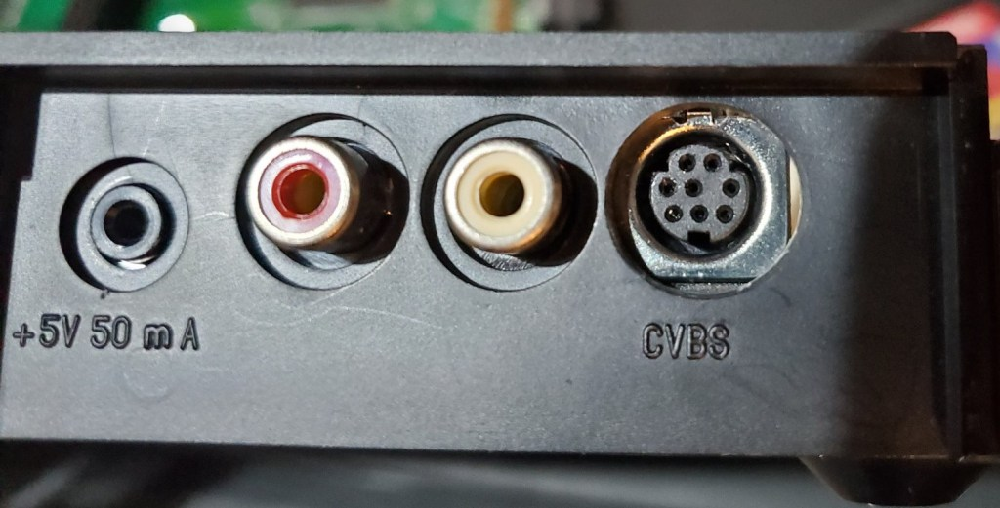

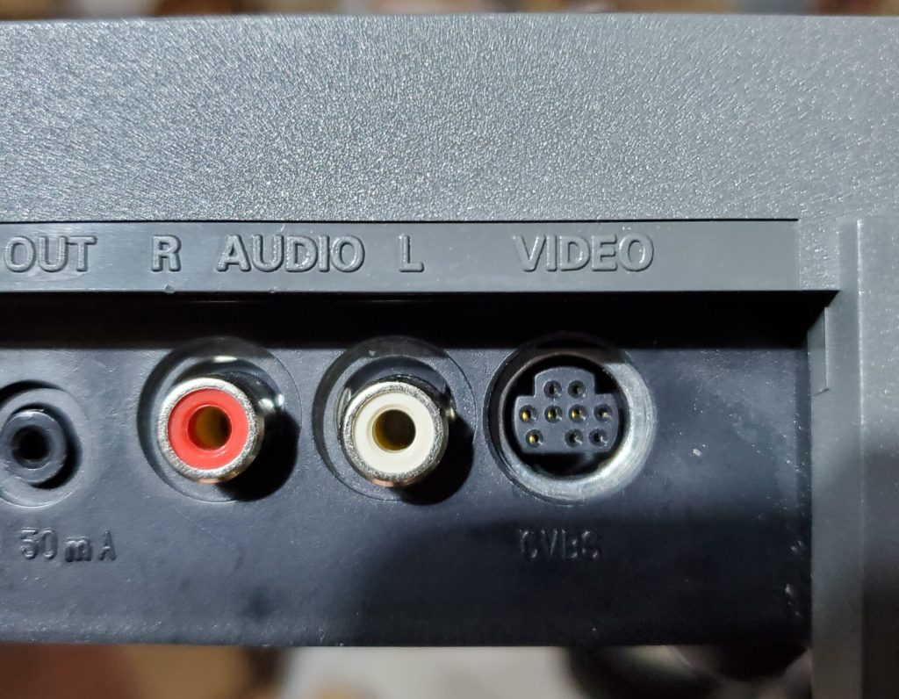